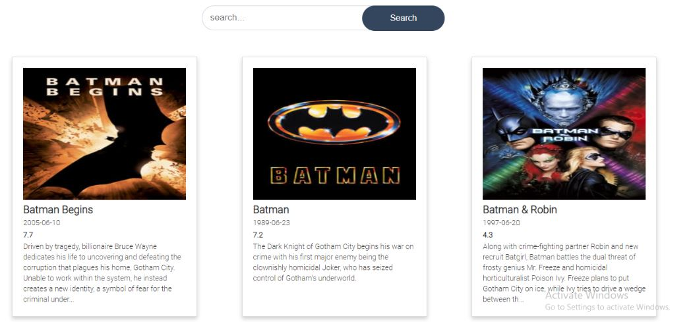
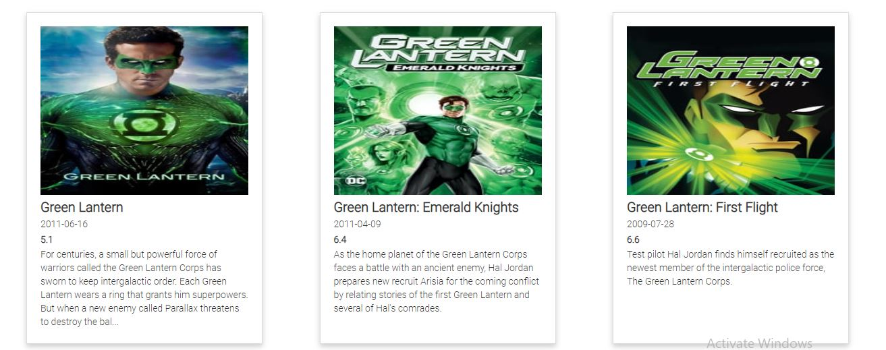

# Movie-finder





## API KEY

[THE-MOVIE-DB-API](https://developers.themoviedb.org/3/getting-started)

## Requirements

```shell

   # Clone the repository
   git clone https://github.com/sheygs13/movie-finder.git
   
   # Change directory
   cd movie-finder
  
   # Install dependencies
   yarn install

   # set env && Run your app
   set/export `API_KEY=VALUE` && yarn start

```
